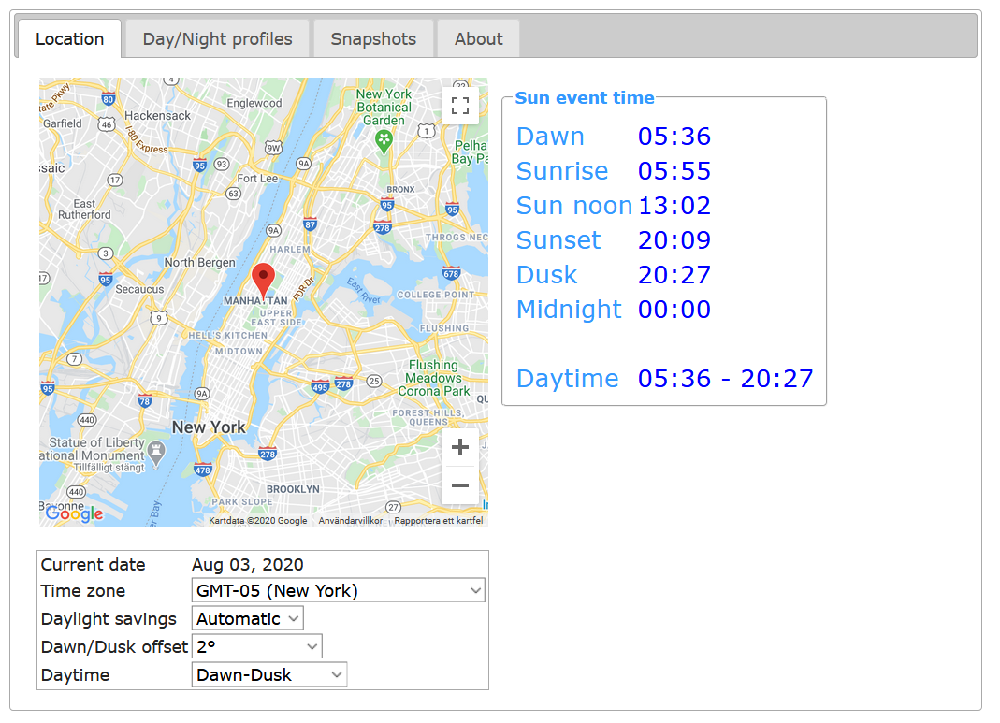

# Daybreak Me
ACAP for Axis Cameras that generates  events on dawn, sunrise, sun noon, sunset, dawn and midnight. 

## Download
- [MIPS](https://github.com/pandosme/acaps/raw/master/daybreakme/files/Daybreak_Me_2_4_0_mips.eap)
- [ARMv7hf](https://github.com/pandosme/acaps/raw/master/daybreakme/files/Daybreak_Me_2_4_0_armv7hf.eap)
- [AARCH64](https://github.com/pandosme/acaps/raw/master/daybreakme/files/Daybreak_Me_2_4_0_aarch64.eap)

# Settings

## Location
Use mouse to move the marker to the city where the camera is mounted.  Note that if the client browser does not have Interner access you will need to manually set the GPS coordinates.

## Device time
Make sure the the cameras time zone, DST is correctly set.

### Dawn/Dusk offset
Dawn/dusk maybe be too dark and sunrise/sunset may be too bright for some use cases.  By adding a sun angle offset a few degrees, the dawn/dusk times will be adjuste (brigter).  By setting the value to 2 degrees, the dawn time will be adjusted inbetween the real dawn and the sunrise (the same applies to dusk).
