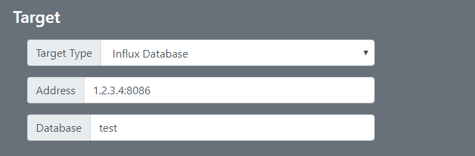
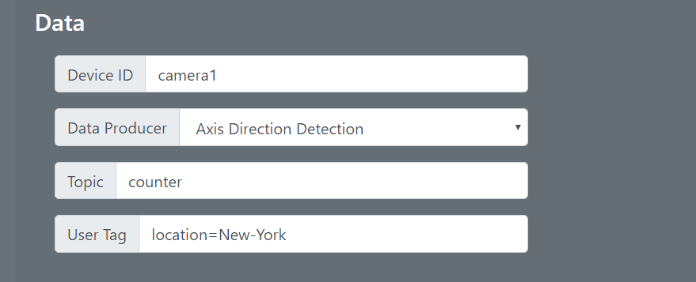
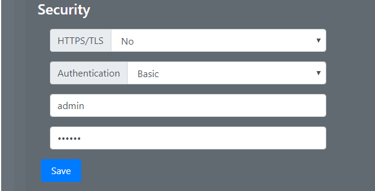

# Publisher 2.0-0
Publisher is primarily targeting systems that needs to get event analytic payloads into a database.  A jpeg image, taken at detection time, can also be included in the data.  Publisher can send data to MQTT Broker, Influx Database or a HTTP Server depending on the system environment.

## Supported Analytics
1. AXIS License Plate Verifyer
2. AXIS Direction Detetor
3. AXIS VMD4
More will be added.

## Supported platforms
1. [mips.eap](https://github.com/pandosme/acaps/raw/master/publisher/mips.eap)
2. [armv7hf.eap](https://github.com/pandosme/acaps/raw/master/publisher/armvh7hf.eap)

# Requirements
1. An Axis Camera
2. One of the supported Video Analytcs ACAP (Data Producer) installed and configured in the device
3. Publisher installed and configured on the device
4. An Influx server, HTTP server or MQTT Broker

# Configuration



## Target Type
Select MQTT, Influx or HTTP depending on what server you may have.

## Address
Set IP address or FQDN and port number.

Examples
```
  mqtt.server.com:1883
  web.server.com/my/end/point
  influx.server.com:8086
```
## Database
Set the name of the database (only applicable for Influx).  Note that you need to create the database first.  Setting up an Influx server is easy with the [Influx Docker](https://hub.docker.com/_/influxdb).




## Device Name
A user device name (property=name)

## Data Producers
* AXIS License Plate Verifier
* AXIS Direction Detector
* Axis Motion Detection (VMD)

### Topic
For Influx the is the name of the Influx measurement that data will be stored.
For HTTP this will be added as a property

### User Tags
Sometimes it is needed to add additional tags that are not part of the data producer payload.
> Note that you may not use any spaces in the key or value field (if needed, use '-' or '_')

Examples
```
location=New-York
country=France,city=Paris,store=some-id
```
For Influx the names will be added a tags.
For HTTP the names will be added as properties in JSON payload.

### Image
Sometimes you want to store an image when detection occured.  Setting Image will append a JPEG image on published data.  Leave blank if you do not want an image.  The image will be base64 encoded.

> Note that images takes up a lot of storage space.  It is recommended to use a medium size resolution, typical 640x360 (16:9), 640x480 (4:3) or 640x640 (1:1) depending on the camera aspect ration.

Image syntax
```
resolution=640x360
```
Influx: The image will be stored on Influx with value name "image".
HTTP: The image will have JSON property name "image".



## HTTPS/TLS
If the server requires HTTPS, set value other than "No".  This will append "https://" to the address.
If the server has a self-signed or private CA certificate, select "Accept untrusted certificate".
If the server has a certificate signed by a public CA (e.g. LetsEnrypt), select "Validate certificate"

## Authentication
* None - No authentication will be done regardless if user/password is set
* Basic -  Influx supports basic
* Digest (encrypted passwords) - Many web servers supprts digest authentication.
* Beare/Token.  Set you token in the password field.  This will append HTTP header "Authorization: Bearer myToken"
