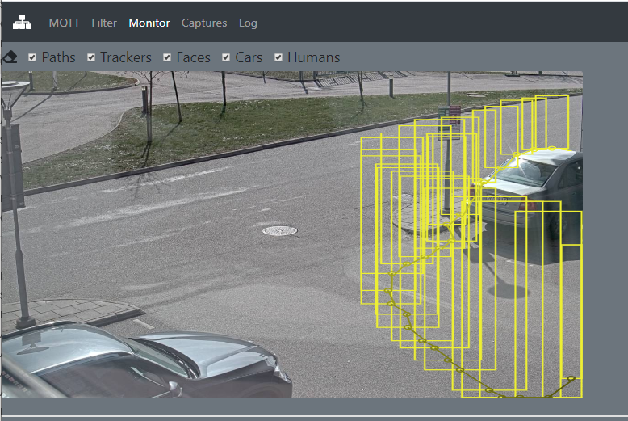
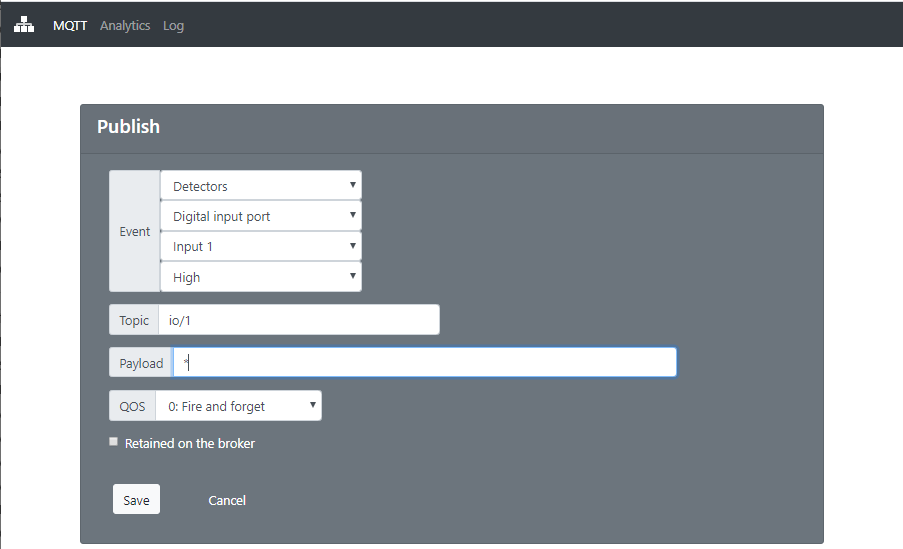

# Tracker
ACAP for Axis Camera & Radar that publish events, motion & radar trackers on MQTT. 

## MQTT Settings


## Filter - Optimze the system
In many cases there are areas where there is no interest in tracking objects. Filtering unnessessery data will optimize the system perfomance.  On the filter tab you can define an area where objectes needs to appear (Birth Area), how old they need to be and how often objects are published. 

* Birth area:  Defines an  area that the object needs to appear or pass before tracking starts.  Click the green button and use mouse to adjust area.
* Minumum objects size:  The minimum size an object needs to have to be before tracking starts.  This filter is a bit unpredicable and it is recommended to use small minimum size.
* Minumum age:  Filters short and sporadic objects.  Set the number of milliseconds that object needs tracked before being published.  A recommed value is between 100 - 1000 ms depending on scene.
* Maximum Idle:  Sometimes objects will be hanging in the scene.  Set maximum time before tracking is stopped.  Recommeded value is 60000+ ms.
* Swaying:  How far the object needs to move (% of image) before a new object is published.  A recommed value is 3-5%.

So, tracking starts when an object passes birth area, have a minimum age, at a minimum size.  Objects are updated/published when object moves saying distance.  Once the tracker started it will continue to track the object until it leaves the scene or terminated by Max Idle Time.


## Monitor - MQTT Visualization
In the monitor tab you can validate published data as bounding boxes and/or paths



## Publish - User defined publish
Tracker can monitor any event in camera and send a MQTT message.

1. Select the camera event
2. Set whatever topic you want
3. Set any payload you want or use * to get the event payalod as the MQTT payload.  The * is needed if you want to get payload including data produced by an analytics ACAP.




# MQTT Topics

### connect/MQTT_Client_ID  [RETAINED]
Annoucement when connecting to broker
```
{
  connected: true,
  client: string,          //MQTT client ID
  model: string,           //Axis product model
  type: string,            //Example "Network Camera"
  serial: string,          //Example "ACCCxxxxxxx"
  mac: string,             //Example "AC:CC:xx:xx:xx:xx"
  IPv4: string,            //IP address
  firmware: string         //Firmware version
  chip: string,            //HW platform
  aspect: string,          //Aspect ration "16:9","4:3","1:1"
  rotation: number         //0,90,180,270 degrees rotation
}
```

### connect/MQTT_Client_ID [RETAINED]
Last-will testamanet when disconnecting from broker
```
{
  connected: false,
  client: string,          //MQTT client ID
}
```
### tracker/MQTT_Client_ID
```
{
  source: string,       //MQTT Client ID
  id: number,           //Unique tracking ID for each object being tracked
  phase: number,        //0: new object detected, 1: object is tracked, 2: object left scene
  timestamp: number,    //UTC ms resolution
  x: number,            // X coordinate [left to right 0 – 1000]
  y: number,            // Y coordinate [top to bottom 0 – 1000]
  w: number,            // Width [0-1000].  Always 10 on radar
  h: number,            // Height [0-1000].  Always 10 on radar
  cx: number            //Center of gravity (x + w/2)
  cy: number,           //Center of gravity (y + h)
  class: {              //Object classifications.
    human: false,       //
    vehicle: false,     //
    face: false         //
  },
  radar: {              //Only relavent for radar
    speed: number,      //Object speed [m/s]
    direction: number,  //Object placement angle from radar center [-180 to 180 degrees]
    distance: number,   //Object distance from radar [meters]
    angle: number       // Object traveling direction related to radar center [-180 to 180 degrees]
    class: number       // Object classification. 2: Undefined, 3: Human, 4: Vehicle
  },
  age: number,          //ms from birth
  distance: number,     //Distance traveled from birth place [0-1000]
  speed: number,	      //Average speed from birth [% distance per second]
  dx: number,           //X Movement from birth [0-1000]
  dy: munber,           //Y movement from birth [0-1000]
  birth: {              //Birth time & place
    timestamp: number,
    x: number,
    y: number,
    w: number,
    h: number,
    cx: number,
    cy: number
  },
  previous: {           //Previous published cx,cy.  Used for drawing path line
    cx: number,
    cy: number
  },
  pause: {              //Longest place where object paused during tracking
    time : number,      //Amount of ms spent in the location
    cx: number,
    cy: number
  }
}
```
### class/MQTT_client_ID/[face, vehicle, human]
Object classifictions is published when installed on a camera with ARTPEC-7 running firmware 9.20 or later.
```
{
  source: string,       //MQTT Client ID
  id: number,           //Unique tracker ID if "motion required" is set.  Otherwise 0
  timestamp: number,    //UTC ms resolution
  x: number,            // X coordinate [left to right 0 – 1000]
  y: number,            // Y coordinate [top to bottom 0 – 1000]
  w: number,            // Width [0-1000].  Always 10 on radar
  h: number,            // Height [0-1000].  Always 10 on radar
  cx: number,           //Center of gravity (x + w/2)
  cy: number,           //Center of gravity (y + h)
  type: number,         //Internal use
  confidence : number,  //Some sort of confidence.  Not predictable
  class: string         //Classification "human", "face" or "human"
}
```
