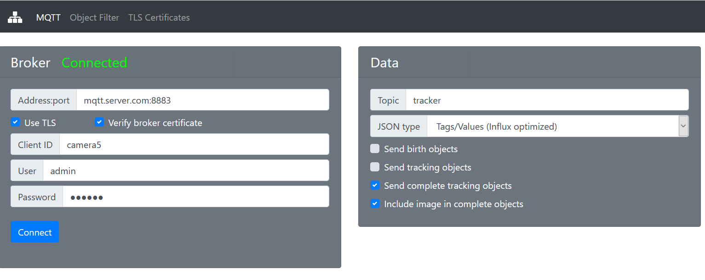
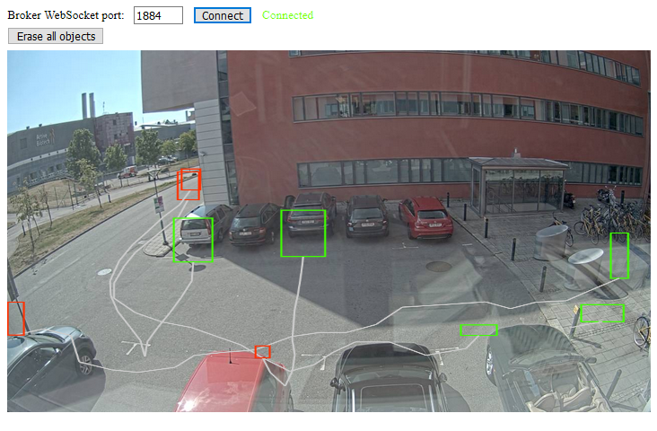

# Tracker
ACAP for Axis Cameras and AXIS D2050 radar that publish motion trackers on MQTT. This ACAP targets system integrators and application developers.



## Use cases
- Build unique motion detection filters based on object age, direction, birth/death location and speed
- Log or count all moving object (their motion path in scene) with or without image capture
- Add visual augmentation in clients

[Node-Red examples](https://github.com/pandosme/acaps/tree/master/tracker/examples)

## Download ACAP file to install in Axis Camera (based on camera hw platform)
Note that the camera firmware needs to be version 9.80.0 or later.
- [MIPS](https://github.com/pandosme/acaps/raw/master/tracker/files/Tracker_2_6_3_mips.eap)
- [ARMv7hf](https://github.com/pandosme/acaps/raw/master/tracker/files/Tracker_2_6_4_armv7hf.eap)
- [AARCH64](https://github.com/pandosme/acaps/raw/master/tracker/files/Tracker_2_6_3_aarch64.eap)


# Settings

## MQTT Broker
Settnings should pretty straight forward.

### Open Web Client
Opens a new page that has an MQTT client that can be used to visualize tracking data and JSON payload.  The web client needs to connect to the MQTT Broker WebSocket port.  Visualizing is primarily to validate things are working and as a tool to optimize filters.



*Green boxes are birth objects, red are death objects and line is continous tracking without boxes.*

## MQTT Data settings
### Publish birth objects
 Sends message when a new object is detected in the scene that fulfills the birht criteria.  Should be disabled if there are no consumer that requires real-time data.

### Publish continous tracking
Sends object update when object moves more than Tracker Sway limit.  Should be disabled if there are no consumer that requires real-time data.

### Publish tracking complete
After an object left the scene (object death), a message will be send containing birht and deat information.  This is typically used when detected objects are store in a database.  

### Include birth image
Include a JPEG image in the last message (complete tracking) message.  The image will be base64 encoded.

### Additional tags (optional)
Add custom JSON properties:values that will be included in the payload.  This is typically used for setting "nice name", "location" or other infomration when dealing with more than than one camera in the system.

## MENU: Object Filter (Optimze the system)
In many cases there are areas where there is no interest in tracking objects. Filtering unnessessery data will optimize the system perfomance.  On the filter tab you can define an area where objectes needs to appear (Birth Area), how old they need to be and how often objects are published. 

A birth message and tracking will start when an object is inside the birth area, is at least X seconds and traveled Y % distance.  Tracking objects will then be published until the object disapears from scene.

A death object will only be published when all filters are fulfilled including minimum age, distance and max speed. 


* Tracker Sway limit:  Redcues the number of publishing when tracking. The object needs to move x% before an update is published.   Recommeded value is 3-5%.
* Birth area:  Defines an  area that the object needs to pass before tracking starts.  Click the green button and use mouse to adjust area.
* Birht min age:  Defines the time between an object is detected and when a birth message is posted.  Increase time reduce sporadic detections.
* Birth min distance:  Defines the distance a detected object needs to move before a birth message is posted.  Increase distance to reduce sporadic detections.
* Min age, distance and speed is similar to Birth-settings.

## TLS Certificates
If the MQTT Broker requires client certificate, upload them here.

## Payload
Data structure depends on user selection but will contain the following.
```
{
    "client": string,            //MQTT Client name
    "device": string             //Device serial number
    "timestamp": number,         //EPOCH timestamp ms resolution
    "phase": number,             //0 = new object detected, 1 = object is tracked, 2 = object left scene (dead)
    "id": number,                //Unique tracking ID for each object being tracked
    "x": number,                 //Bounding box x,y,w,h
    "y": number,                 //Coordinate system is [0,0]-[1000,1000].  [0,0] is top left corner
    "w": number,
    "h": number,
    "cx": number,                //Center of gravity 
    "cy": number,         
    "dx": number,                //Total X distance traveled since birth [-1000,1000]
    "dy": number,                //Total Y distance traveled since birth [-1000,1000]
    "age": number,               //Age in seconds since birth
    "speed": number,             //Total distance in percent/second
    "distance": number,          //Distance traveled in percent of view 
    "pause": number,             //The longest pause the object made while beining tracked
    "pauseX": number,            //Location of longest pause
    "pauseY": number,
    "pcx": number,               //Previous CX,CY.  Used for drawing path in live visualization
    "pcy": number,
    "birth": number,             //When object was born.  EPOCH timestamp ms resolution
    "bx":number,                 //Birth x,y
    "by":number,                 
    "bw":number,                 //Birth width & height
    "bh":number,
    "bcx":number,                //Birth center of gravity cx,cy
    "bcy":number
}
```

whe used on an Axis Radar, the additional data will be included
```
  "radar": {
    “speed”: number,
    “direction”: number,
    “distance”: number,
    “angle”: number,
    “class”: number
  }
```
- Speed: Object speed in meter/second
- Direction:  Object direction angle in degrees -180 to 180 where 0 is direction towards the radar
- Distance:  Distance in meter between object and radar
- Angle: The location angle of the object related to the radar direction (-180 to 180)
- Class:  Object classification. 2 = Undefined, 3 = Human, 4 = Vehicle.  Note that Classification is a bit unpredictable.

