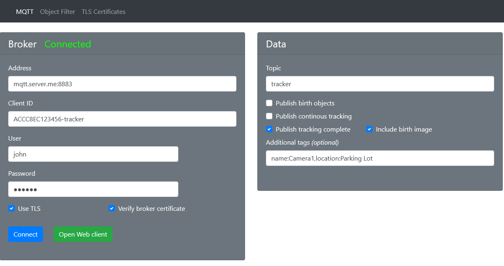
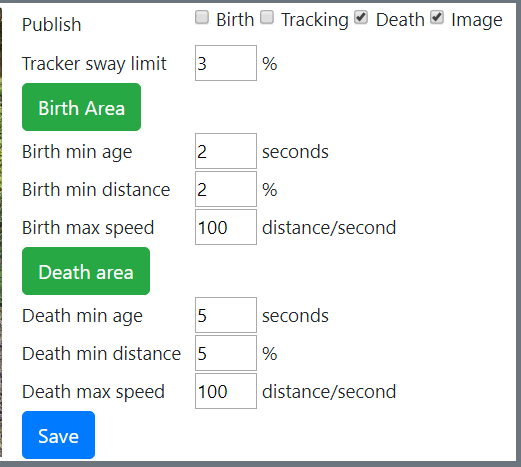

# Tracker 2.0-1
ACAP for Axis Camera & Radar that publish events, motion & radar trackers on MQTT. 

**Big breaking changes in 2.0-0.  Check changelog**

## MQTT Settings

Settnings should  pretty straight forward.  Note that only TCP/MQTT is support, not TLS nore WebSocket.



- Tracker Publish version defines the data structure for the structure.  Version 1 is deprecated and should only be selected if the use case requires it.  New integrations should use version 2. 

## Filter - Optimze the system
In many cases there are areas where there is no interest in tracking objects. Filtering unnessessery data will optimize the system perfomance.  On the filter tab you can define an area where objectes needs to appear (Birth Area), how old they need to be and how often objects are published. 

A birth message and tracking will start when an object is inside the birth area, is at least X seconds and traveled Y % distance.  Tracking objects will then be published until the object disapears from scene.

A death object will be published after an object is born and fulfilled the death age, distance and max speed. 



* Publish: Depending on use-case.  "Birth" and "Tracking" should be enabled fo real-time applications (e.g. visualization). "Death" should be enabled used for post-processing application.  A JPEG image from birht detection may also be included in the Death message.
* Tracker Sway limit:  Redcues the number of publishing when tracking. The object needs to move x% before an update is published.   Recommeded value is 3-5%.
* Birth area:  Defines an  area that the object needs to pass before tracking starts.  Click the green button and use mouse to adjust area.
* Birht min age:  Defines the time between an object is detected and when a birth message is posted.  Increase time reduce sporadic detections.
* Birth min distance:  Defines the distance a detected object needs to move before a birth message is posted.  Increase distance to reduce sporadic detections.
* Min age, distance and speed is similar to Birth-settings.

# MQTT Topics

### connect/MQTT_Client_ID [RETAINED]
Last-will testamanet when disconnecting from broker
```
{
  connected: false,
  client: string,          //MQTT client ID
  serial: string,          //Example "ACCCxxxxxxx"
}
```
### tracker
Data structure is optimized for post-processing (Time Series Database).
```
{
  "tags": {
    "client": string,            //MQTT Client name
    "device":"ACCC8Exxxxxx"      //Device serial number
  }
  "values": {
    "timestamp": number,         //EPOCH timestamp ms resolution
    "birth": number,             //When object was born
    "phase": number,             //0 = new object detected, 1 = object is tracked, 2 = object left scene (dead)
    "id": number,                //Unique tracking ID for each object being tracked
    "x": number,                 //Bounding box x,y,w,h
    "y": number,                 //Coordinate system is [0,0]-[1000,1000].  [0,0] is top left corner
    "w": number,
    "h": number,
    "cx": number,                //Center of gravity 
    "cy": number,         
    "dx": number,                //Total X distance traveled since birht -1000 - 1000
    "dy": number,                //Total Y distance traveled since birht -1000 - 1000
    "age": number,               //Age in seconds since birth
    "speed": number,             //Total distance in percent/second
    "distance": number,          //Distance traveled in percent of view 
    "pause": number,             //The longest pause the object made while beining tracked
    "pauseX": number,            //Location of longest pause
    "pauseY": number,
    "pcx": number,               //Previous CX,CY.  Used for drawing path in live visualization
    "pcy": number,
    "bx":342,                    //Birth x,y,w,h,cx,cy
    "by":292,
    "bw":647,
    "bh":246,
    "bcx":665,
    "bcy":538
  }
}
```
