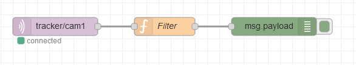
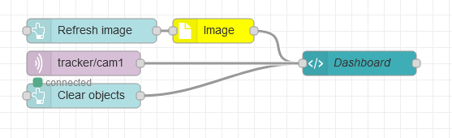

# Node-Red examples
[Node-Red]() is a simple and fantastic web-based tool to integrate anything with everything with limited programming skills.  With a the node-Red dashborad you can easily build web applications and web services.

The following are som simple flow examples how to use Tracker for various tasks.

## Basic motion filter
The following example collects tracker data, filters on objects going downwords with an age of at least 5 seconds.

[Copy the flow](flows/filter.json) and import into your node red.

## Dashboard visualizations

## Loggin to Influx Dabase

